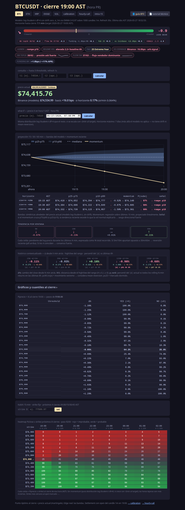
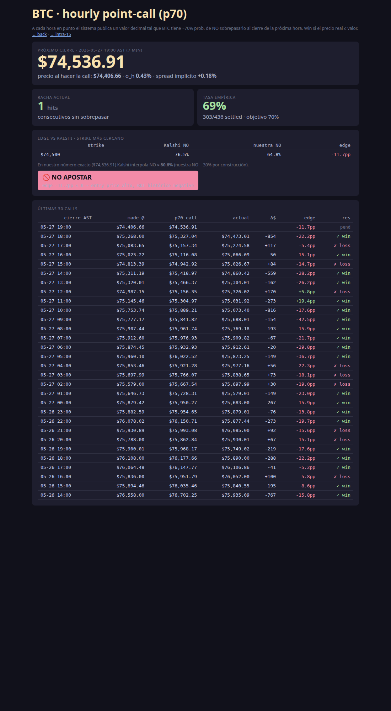
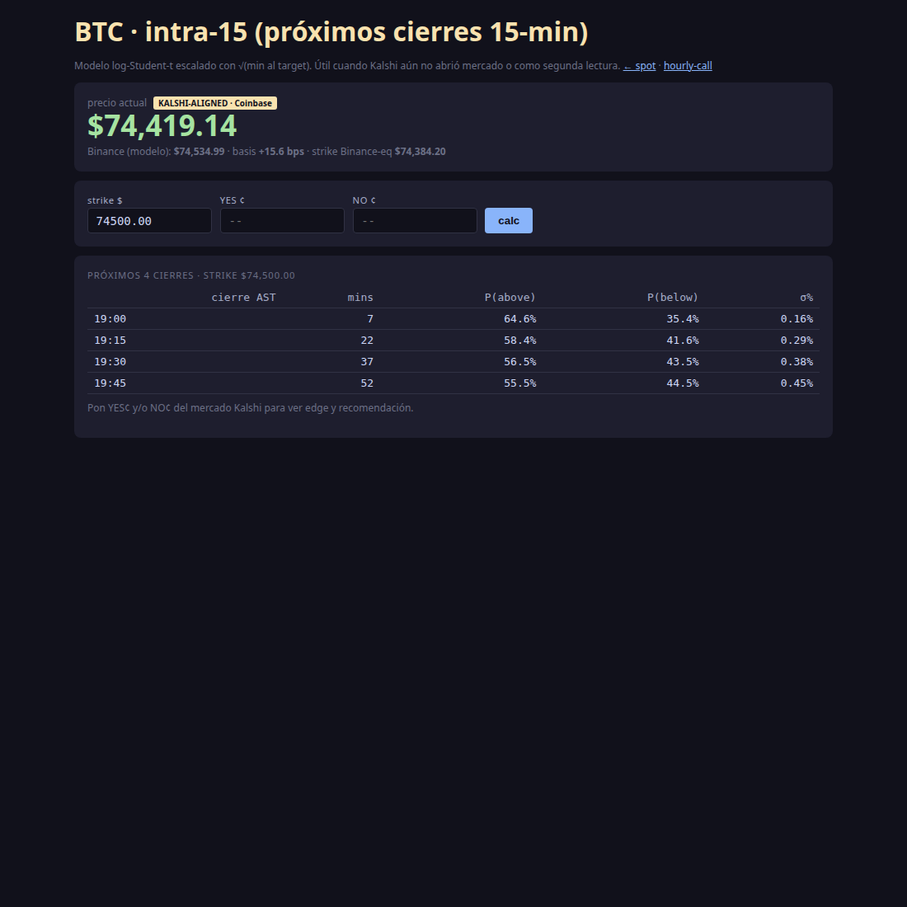
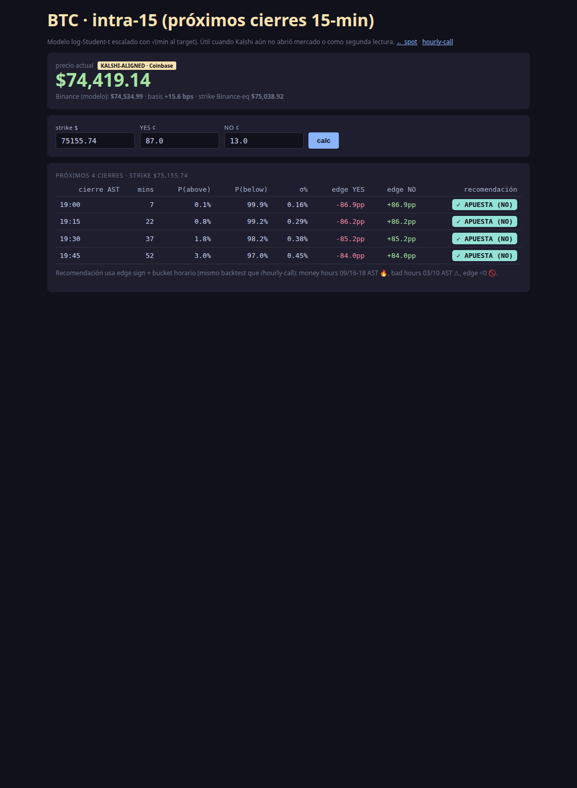
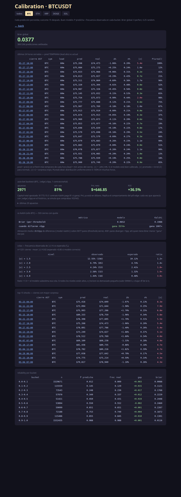

# BTC Predictor — Guía rápida (para ti)

App educativa que predice el precio de Bitcoin y te ayuda a decidir si apostar
en los mercados horarios y de 15 minutos de Kalshi. **Sin dinero real**.

> URL local: `http://100.122.62.70:8001` (tienes que estar en Tailscale)

Esta guía no explica cómo funciona el modelo por dentro — para eso está
`tutorial.pdf`. Aquí sólo verás **qué puedes hacer** con cada pantalla y
**cómo leer los números** para tomar decisiones.

---

## ¿Qué problemas resuelve?

1. **¿Va a estar el precio arriba o abajo de X a tal hora?** → /hourly-call (cierre 60 min) y /intra15 (cierres de 15 min)
2. **¿Vale la pena la apuesta que veo en Kalshi?** → en cualquiera de las dos vistas: pega el precio YES/NO y te dice el edge y un badge de recomendación
3. **¿Qué tan bien estoy acertando?** → /calibration
4. **¿Qué pasa si el precio sube X% en Y minutos?** → / (página principal: what-if + fan chart)

---

## 1 · Página principal `/`

### Lo que ves arriba

- **Hero verde grande** = precio actual de Bitcoin en **Coinbase** (marcado `KALSHI-ALIGNED`). Este es el precio que Kalshi usa para liquidar — es el que importa para apostar.
- **Binance (modelo)** = el precio de la otra exchange, normalmente unos cuantos dólares arriba. Es el que el modelo usa para sus cálculos. La diferencia (`basis +XX bps`) suele ser pequeña (10–25 bps).

> 💡 **Para dummies:** si Kalshi te dice "BTC ≥ $75,500" mira el precio Coinbase, no el de Binance.

### Tabs arriba

- `BTC` `ETH` `XRP` ... — cambia de cripto. Solo BTC tiene mercado Kalshi.
- `calibration` — qué tan bueno fue el modelo (sección 4)
- `hourly-call` — la apuesta horaria (sección 2)
- `intra15` — las apuestas de 15 minutos (sección 3)

### Tarjetas que te interesan

- **Quantiles / niveles** — el modelo dice "hay 90% de probabilidad de que BTC esté entre $X y $Y al cierre". Útil para ver si tu strike de Kalshi cae dentro o fuera del rango.
- **What-if** (formulario abajo) — pones un precio y una hora y te devuelve `P(above)` y `P(below)`. Sirve cuando Kalshi te ofrece un strike rarito que no aparece en los otros tabs.
- **Fan chart** — gráfico SVG con bandas de incertidumbre. Visualmente: cuanto más se abre el abanico, más insegura está la predicción.
- **Signals / tension** — resumen direccional. Score entre -5 (bearish) y +5 (bullish).

---

## 2 · `/hourly-call` — la apuesta de cada hora

Kalshi tiene un mercado cada hora: "¿BTC va a estar por encima de $X al cierre?". Esta vista te ayuda a decidir.

### Cómo se lee

- **Hero amarillo** = el valor "call". El modelo dice que hay 70% de probabilidad de que BTC **no** sobrepase ese número al cierre de la próxima hora.
- **Racha actual** = cuántas calls seguidas hemos acertado (precio real ≤ call).
- **Tasa empírica** = % de aciertos histórico. Si está cerca de 70% el modelo va bien calibrado.

### El bloque "edge vs Kalshi"

- **strike** = el strike más cercano de Kalshi al valor que predijimos
- **Kalshi NO** = lo que el mercado paga por el contrato NO
- **nuestra NO** = lo que el modelo cree que vale (70% por construcción)
- **edge** = diferencia en puntos porcentuales (pp). **Positivo = el modelo cree que NO está barato → apuesta NO**.

### El badge de recomendación 🔥 / ✓ / ⚠ / 🚫

Basado en backtest de 414 calls:

| Badge | Cuándo aparece | Qué hacer |
|---|---|---|
| 🔥 **APUESTA FUERTE** | edge ≥ 0 **y** cierre 09/16/17/18 AST (money hours, WR 88-100%) | Apostar con confianza |
| ✓ **APUESTA** | edge ≥ 0 (resto de horas) | Apostar normalmente |
| ⚠ **HORA MALA** | edge ≥ 0 pero cierre 03 o 10 AST (WR ≤50%) | Mejor pasar |
| 🚫 **NO APOSTAR** | edge < 0 (entry price alto, ROI histórico negativo) | No apostar nunca |

> ⚠️ **Regla dura del backtest:** edge negativo **siempre** pierde en promedio aunque parezca que ganas seguido. El payoff no compensa porque el contrato cuesta caro.

### Tabla "últimas calls"

Las últimas 30 calls con su edge y resultado. Útil para ver si el modelo está en racha o frío.

---

## 3 · `/intra15` — apuestas de 15 minutos

Esta es la pantalla nueva. Kalshi a veces abre mercados cortos de 15 min (cierre 17:15, 17:30, etc.) — pero no siempre. Aquí puedes pedirle al modelo la predicción tengas mercado o no.

### Para usarla sin Kalshi

1. Mete un **strike** (ej. $75,155.74)
2. Dale `calc`
3. Te devuelve los próximos 4 cierres de 15 min con `P(above)`, `P(below)` y σ
4. Sirve para tener una intuición: "¿qué tan probable es que BTC cruce $X en la próxima hora?"

### Para usarla con un mercado Kalshi abierto

1. Mete **strike** + **YES ¢** + **NO ¢** (lo que veas en Kalshi)
2. Dale `calc`
3. Ahora cada fila muestra:
   - **edge YES** y **edge NO** (en pp)
   - **recomendación** (mismo badge que /hourly-call, indica si conviene YES o NO)

> 💡 **Truco:** si YES vale 87¢ y NO vale 13¢ en Kalshi, escribe los dos. El sistema elige el lado con más edge y te lo marca entre paréntesis: `🔥 APUESTA FUERTE (NO)`.

### Lo que dice la cabecera

- **Hero Coinbase** = precio Kalshi-aligned (otra vez, el que importa)
- **basis** = cuánto difiere Binance de Coinbase en ese momento
- **strike Binance-eq** = el strike que Coinbase muestra, traducido a precio Binance (para entender cómo lo "ve" el modelo)

---

## 4 · `/calibration` — ¿qué tan bueno es el modelo?

Vista para revisar el desempeño histórico.

### Lo que importa

- **Brier score** — entre 0 (perfecto) y 1 (pésimo). Cualquier valor por debajo de 0.25 es razonable; por debajo de 0.20 es bueno.
- **Reliability** — tabla que dice "cuando el modelo dijo 70% acerté el 68% del tiempo". Si los números coinciden, está bien calibrado.
- **Recent outcomes** — últimas 24 calls horarias con su acierto/fallo.
- **Top shocks** — las predicciones donde más se equivocó. Útil para detectar regimes nuevos.
- **Auto-bet backtest** — qué hubiéramos ganado siguiendo las recomendaciones del badge. ROI histórico.

---

## 5 · Reglas que el backtest reveló (resumen)

Para no leer todo: estas son las reglas duras que aprendimos perdiendo dinero virtual:

### ✅ Apuesta si

- Edge ≥ 0 (siempre, sin excepción)
- Cierre en hora 09 / 16 / 17 / 18 AST → edge positivo aquí es 🔥
- Strike alejado del spot en mercados de cola (tipo Kalshi NO [≤X] con X bien por debajo de la mediana de modelos externos)

### 🚫 No apuestes si

- Edge negativo (aunque el WR parezca alto: el payoff te mata)
- Cierre en hora 03 o 10 AST (WR ≤50% histórico, evítalo)
- Modelo en racha negativa de 3+ pérdidas (debería bloquearse solo, pero revisa)

### ⚠️ Observación pendiente de confirmar

- Edge marginal (0 a +8pp) + trend 24h negativo (-1% o peor) → parece trampa aunque sea money hour. Tenemos un solo dato (2026-05-27 17:00), si se repite se endurece la regla.

---

## 6 · Flujo típico de uso

**Mañana (chequeo general):**
1. Abro `/?symbol=BTCUSDT` → veo el precio Coinbase, el momentum, signals
2. Voy a `/hourly-call` → veo si la call de la próxima hora tiene edge

**Cuando aparece una apuesta en Kalshi:**
1. Anoto strike, YES¢ y NO¢
2. Si es mercado horario → `/hourly-call` ya lo tiene calculado (mira el badge)
3. Si es mercado de 15 min → abro `/intra15`, meto los 3 valores, miro el badge
4. Decido según el badge:
   - 🔥 → entro con confianza
   - ✓ → entro
   - ⚠ → paso
   - 🚫 → paso (no excepciones)

**Al final del día (review):**
1. Voy a `/calibration` → veo Brier y reliability
2. Reviso "auto-bet backtest" para confirmar ROI

---

## 7 · Glosario rápido

| Término | Qué significa |
|---|---|
| **edge** | diferencia entre lo que paga Kalshi y lo que el modelo dice que vale (en pp) |
| **strike** | el precio sobre/bajo el que se decide el mercado |
| **NO/YES** | lados del mercado binario de Kalshi |
| **pp** | "puntos porcentuales" (diferencia absoluta entre porcentajes) |
| **AST** | hora de Puerto Rico (UTC-4, sin horario de verano) |
| **money hour** | hora del día donde históricamente acertamos mucho (09/16/17/18 AST) |
| **basis** | diferencia entre Binance y Coinbase, en basis points (1bp = 0.01%) |
| **σ (sigma)** | desviación estándar — qué tanto puede moverse el precio |
| **Brier** | métrica de qué tan bien calibrado está el modelo (menor = mejor) |
| **WR** | win rate (% de aciertos) |
| **ROI** | retorno sobre la inversión |

---

*Última actualización: 2026-05-27.*
